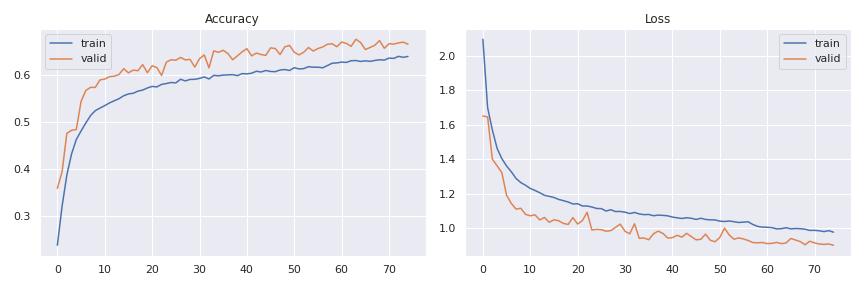
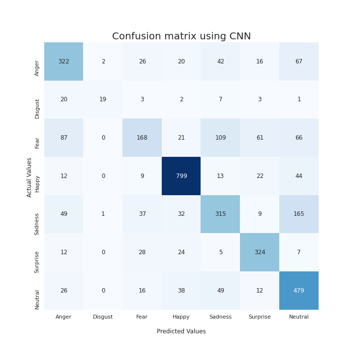

# Facial-Emotion-Recognition

This repository contains code for a Facial Emotion Recognition (FER) system. The code provided implements a Deep Convolutional Neural Network (DCNN) for facial emotion recognition. The DCNN architecture used in this code is designed to detect and classify emotions from facial images. The trained models achieved 98% accuracy in fer2013.

## Features
- Deep Convolutional Neural Network (DCNN): The code implements a DCNN architecture specifically designed for facial emotion recognition. It uses convolutional layers, batch normalization, max pooling, and dropout to effectively extract features and classify emotions.
- Emotion Classification: The DCNN model classifies facial expressions into different emotion categories, such as happiness, sadness, anger, surprise, fear, and more.
- Model Customization: Users can modify the architecture, adjust hyperparameters, or fine-tune the model to improve performance or adapt to specific use cases.
- Training and Evaluation: The code includes the necessary functions to train the DCNN model on a dataset of labeled facial images and evaluate its performance using metrics like accuracy.
- Summary and Visualization: The code provides a summary of the DCNN model's architecture and layer-wise details.

## Architecture

The architecture described in the code snippet is a Deep Convolutional Neural Network (DCNN) for facial emotion recognition. Here's a breakdown of the architecture:

1. Input Layer: The network takes an input image with the shape (img_width, img_height, img_depth).

2. Convolutional Layers: The network consists of multiple convolutional layers, each followed by batch normalization and ELU activation. The first two convolutional layers have 32 filters and a kernel size of (5, 5), while the next two have 64 filters and a kernel size of (3, 3). The final two convolutional layers have 128 filters and a kernel size of (3, 3). All convolutional layers use the 'same' padding and 'he_normal' kernel initializer.

3. Max Pooling Layers: After each pair of convolutional layers, a max pooling layer with a pool size of (2, 2) is added to downsample the feature maps.

4. Dropout Layers: Dropout layers are included after each max pooling layer with a dropout rate of 0.4, 0.4, and 0.5, respectively. Dropout is used for regularization to prevent overfitting.

5. Flatten Layer: The feature maps are flattened into a 1D vector to be fed into the fully connected layers.

6. Fully Connected Layers: The flattened vector is connected to a fully connected layer with 128 units and ELU activation. Batch normalization is applied, followed by dropout with a rate of 0.6. Finally, a dense layer with the number of classes and softmax activation is used as the output layer.

7. Compilation: The network is compiled with the categorical cross-entropy loss function, the specified optimizer (passed as a parameter), and the accuracy metric.

The architecture incorporates batch normalization, dropout, and ELU activation for regularization and better performance. It follows a pattern of convolutional layers with batch normalization, max pooling, and dropout, followed by fully connected layers with batch normalization and dropout.

## Example Outputs
Here are some example outputs generated by the Facial Emotion Recognition System:

#### Epoch History

The image above shows the training and validation accuracy and loss over epochs during model training. It provides insights into the model's learning progress and helps assess if the model is overfitting or underfitting.

#### Confusion Matrix

The confusion matrix is a visual representation of the model's performance in classifying emotions. It shows the number of correct and incorrect predictions for each emotion category. The confusion matrix helps evaluate the model's accuracy and identify any patterns or biases in the predictions.

### Issues & Suggestions
If any issues and suggestions to me, you can create an [issue](https://github.com/Siddhant-Agarwal4583/Facial-Emotion-Recognition/issues).
